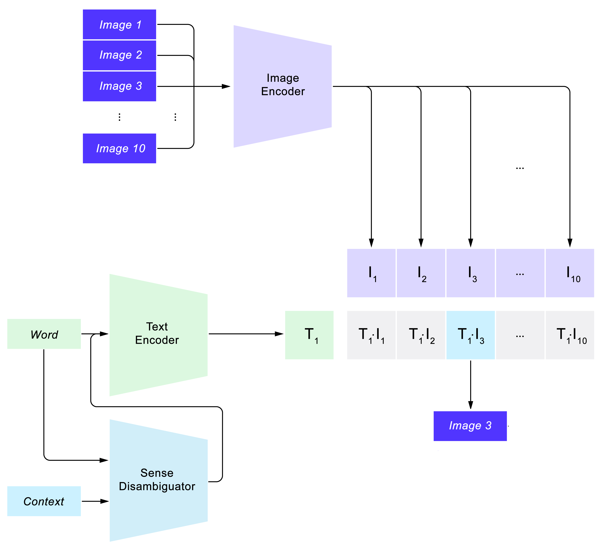

# Visual Word Sense Disambiguation - SemEval2023
In this work we present a competitive solution for the Visual Word Sense Disambiguation task as defined in the 2023 SemEval challenge.

This is done by using different kinds of word sense disambiguation algorithms in order to expand the target word context, then connecting images and texts vector representations by using different variants of the CLIP model.
By using this approach we are able to obtain results over the baselines even without fine tuning the model. After fine tuning the smaller model we obtain similar performances to the biggest not fine tuned model, meaning that fine tuning is useful and we probably still have room for improvement on bigger models.

## Project Structure
All the code use to train and evaluate the models is in the `vwsd.ipynb` notebook, while an extensive documentation of the process is in the `docs/docs.pdf` file.

## Architecture

## Results
**Baselines:**
| Model | MRR | Hits@1 | Hits@3 |
|---|---|---|---|
| Random | 0.317 | 0.125 | - |
| Organizers | 0.739 | 0.605 | - |
| Winners | 0.895 | 0.840 | - |

**Our Models (0-shot):**
| Model | MRR | Hits@1 | Hits@3 |
|---|---|---|---|
| RN50 (MPNet) | 0.772 | 0.654 | 0.857 |
| RN50 (Lesk) | 0.757 | 0.629 | 0.857 |
| RN50 (WordNet) | 0.723 | 0.579 | 0.825 |
| ViT-B-16 (MPNet) | 0.810 | 0.708 | 0.894 |
| ViT-B-16 (Lesk) | 0.788 | 0.674 | 0.881 |
| ViT-L-14 (MPNet) | **0.833** | **0.737** | **0.933** |
| ViT-L-14 (Lesk) | 0.817 | 0.706 | 0.922 |

**Our Models (fine tuned):**
| Model | MRR | Hits@1 | Hits@3 |
|---|---|---|---|
| RN50 (MPNet) | **0.833** | **0.737** | 0.920 |
